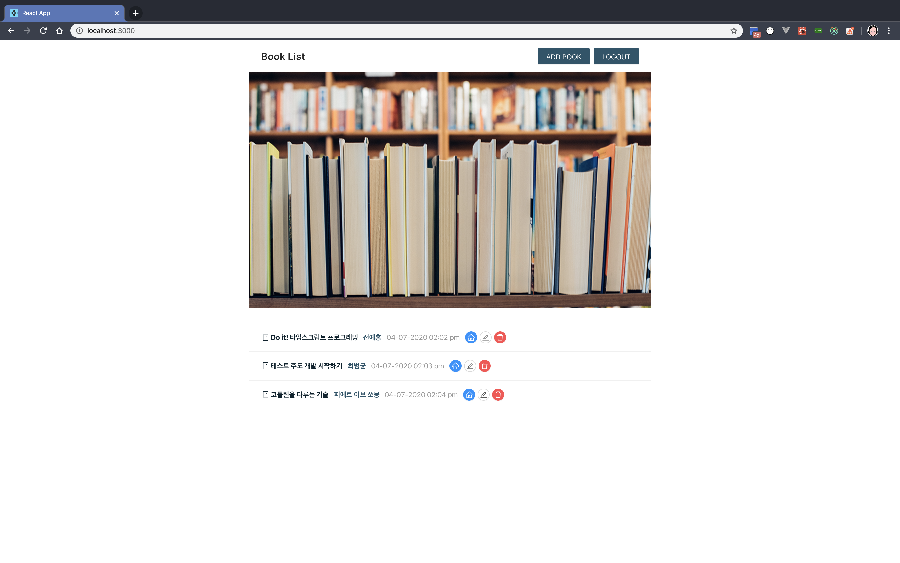
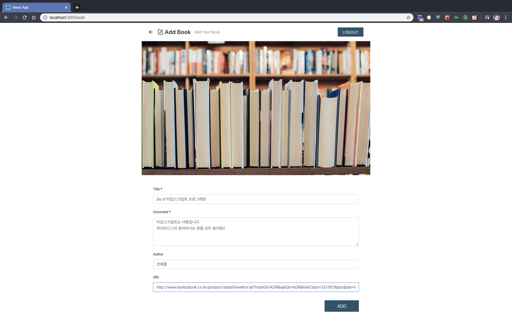
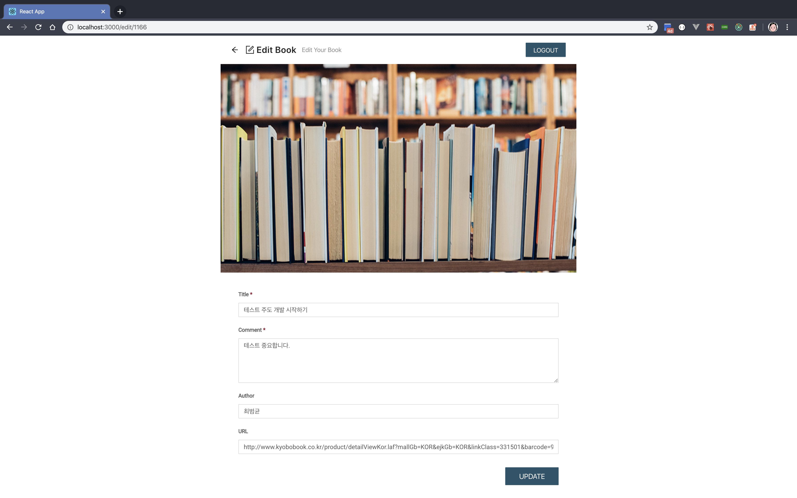

# 나의 독서 기록 사이트 구현하기

## 프로젝트 소개

프론트엔드에서의 `상태관리` 와 `Http 통신에서의 비동기 작업` 은 복잡한 웹서비스를 만드는 기본입니다.

주어진 API 를 바탕으로 간단해보이지만, 정리가 잘 된 비동기 로직을 만들어보세요.

또한 타입스크립트에서 any 를 쓰지않고, 정확한 타이핑과 타입 추론을 통해 컴파일 타임과 런타임의 타입에 대해 꼼꼼히 비교해보세요.

책 추가하기, 책 수정하기, 책 삭제하기, 책 목록 보기 작업을 통해 서버에서 데이터를 받아 클라이언트에 보여주는 흐름을 정확히 관리하고, 상태를 처리해보세요

## 구현해야 하는 기능

나의 독서 기록 사이트는 다음의 기능을 가지고 있습니다.









- [x] 로그인 / 로그아웃
- [ ] 책 목록 표시
- [ ] 책 추가
- [ ] 책 수정
- [ ] 책 삭제

## 개발 환경 설정하기

과제 제출 가이드에 따라 프로젝트를 클론한 뒤, 클론한 프로젝트의 폴더로 가서 의존성 패키지를 설치한 후, 개발 모드로 실행합니다.

```
// nodejs 12.18.1 을 권장합니다.

$ cd 본인과제-레포
$ nvm use (nvm 사용하는 경우)
$ npm ci
$ npm start
```

## 구현 시 참고 사항

- 컴포넌트 스타일링은 CSS Modules 를 사용합니다. 컴포넌트의 스타일링에 초점을 맞춘 과제가 아니기 때문에 모든 스타일은 이미 작성되어 있습니다.
- [Ducks 패턴](https://github.com/erikras/ducks-modular-redux)을 사용하고 있습니다.
- npm start 를 통해 실행 가능한 상태이며, 로그인과 로그아웃 기능은 작성되어 있으니, 참고하면 쉽게 접근이 가능합니다. 계정은 패스트캠퍼스에서 제공됩니다.
- 같은 API 를 사용하는 결과 사이트가 [이곳](https://my-books.now.sh/)에서 서비스되고 있습니다. 같은 계정으로 로그인하여 사용이 가능합니다.
- 사용하는 모든 API는 services 폴더에 작성되어 있습니다. 이곳의 함수를 사용하면 구현이 가능합니다.
